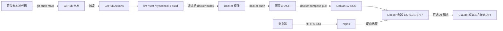

# TS Live Lab 镜像构建与阿里云部署新手指南

本文完整说明 TS Live Lab 从本地代码到公网服务的部署链路：

1. 开发者把代码推送到 GitHub。
2. GitHub Actions 自动检查代码并构建 Docker 镜像。
3. GitHub Actions 把镜像推送到阿里云容器镜像服务 ACR。
4. Debian 12 服务器只从 ACR 拉取镜像，不需要访问 GitHub。
5. Docker Compose 启动应用，Nginx 对外提供域名和 HTTPS。

本文按第一次接触 Docker、GitHub Actions 和 ACR 的读者来编写。命令和地址均针对当前项目，可以直接作为部署基线使用。

## 目录

- [1. 当前项目的实际信息](#1-当前项目的实际信息)
- [2. 整体关联关系](#2-整体关联关系)
- [3. 先理解 ACR 镜像地址](#3-先理解-acr-镜像地址)
- [4. 从零准备阿里云资源](#4-从零准备阿里云资源)
- [5. 配置 GitHub Repository Secrets](#5-配置-github-repository-secrets)
- [6. GitHub Actions 如何构建和推送镜像](#6-github-actions-如何构建和推送镜像)
- [7. Dockerfile 的构建原理](#7-dockerfile-的构建原理)
- [8. Docker Compose 的作用](#8-docker-compose-的作用)
- [9. 环境变量说明](#9-环境变量说明)
- [10. Debian 12 服务器部署：不访问 GitHub](#10-debian-12-服务器部署不访问-github)
- [11. 配置 Nginx 和 HTTPS](#11-配置-nginx-和-https)
- [12. 日常发布和更新](#12-日常发布和更新)
- [13. 回滚](#13-回滚)
- [14. 生产安全建议](#14-生产安全建议)
- [15. 常用运维命令](#15-常用运维命令)
- [16. 常见问题排查](#16-常见问题排查)
- [17. 请求进入服务器后的路径](#17-请求进入服务器后的路径)
- [18. 配置文件索引](#18-配置文件索引)
- [19. 首次上线验收清单](#19-首次上线验收清单)
- [20. 最短日常操作备忘](#20-最短日常操作备忘)

## 1. 当前项目的实际信息

| 项目                | 当前值                                                                                  |
| ------------------- | --------------------------------------------------------------------------------------- |
| GitHub 仓库         | `sxlisme/ts-live-lab`                                                                   |
| GitHub 默认分支     | `main`                                                                                  |
| ACR 地域            | 华东 1（杭州）                                                                          |
| ACR Registry 地址   | `crpi-u11hdbc769825d1d.cn-hangzhou.personal.cr.aliyuncs.com`                            |
| ACR 命名空间        | `sxlisme`                                                                               |
| ACR 镜像仓库        | `ts-live-lab`                                                                           |
| 完整镜像地址        | `crpi-u11hdbc769825d1d.cn-hangzhou.personal.cr.aliyuncs.com/sxlisme/ts-live-lab:latest` |
| 容器内部端口        | `8787`                                                                                  |
| 服务器系统          | Debian GNU/Linux 12（bookworm）                                                         |
| GitHub Actions 文件 | `.github/workflows/docker-image.yml`                                                    |
| 镜像构建文件        | `Dockerfile`                                                                            |
| 服务编排文件        | `docker-compose.yml`                                                                    |
| 环境变量模板        | `.env.example`                                                                          |

这里出现的 Registry 地址和镜像名称可以公开。ACR 用户名、ACR 固定密码、AI Key 和服务器 SSH 私钥不能提交到 GitHub，也不能写进本文。

## 2. 整体关联关系

### 2.1 每个组件负责什么

| 组件           | 职责                                 | 不负责什么                              |
| -------------- | ------------------------------------ | --------------------------------------- |
| 本地 Git 仓库  | 保存开发中的源代码和提交记录         | 不运行生产服务                          |
| GitHub 仓库    | 托管源代码，触发 Actions             | 不长期运行应用容器                      |
| GitHub Actions | 检查、测试、构建镜像并推送 ACR       | 当前不自动登录 ECS 部署                 |
| ACR            | 保存已经构建好的镜像及不同 Tag       | 不保存完整 Git 开发历史                 |
| ECS/个人服务器 | 拉取镜像并运行容器                   | 不需要再次编译 Vue/TypeScript           |
| Docker Compose | 记录镜像、端口、环境变量和安全限制   | 不构建业务代码，服务器使用 `--no-build` |
| Nginx          | 接收公网 HTTP/HTTPS 请求并转发到应用 | 不运行 Node.js 业务逻辑                 |
| Certbot        | 申请并续期 Let's Encrypt HTTPS 证书  | 不托管应用                              |

### 2.2 架构图



### 2.3 一次发布的时间顺序

```text
开发代码
  -> git commit
  -> git push origin main
  -> GitHub Actions 自动启动
  -> npm ci
  -> npm run check
  -> Docker Buildx 构建 amd64/arm64 镜像
  -> 登录 ACR
  -> 推送 latest 和 sha-* Tag
  -> 在服务器执行 docker compose pull
  -> 在服务器执行 docker compose up -d
  -> 新容器替换旧容器
  -> Nginx 继续使用同一个 127.0.0.1:8787 地址
```

当前流水线的“构建镜像”和“部署服务器”是两个阶段：前半段自动，后半段目前需要在服务器手动执行两条更新命令。这样不会因为一次错误提交直接替换线上容器，也不需要把服务器 SSH 私钥交给 GitHub。

## 3. 先理解 ACR 镜像地址

完整镜像地址如下：

```text
crpi-u11hdbc769825d1d.cn-hangzhou.personal.cr.aliyuncs.com/sxlisme/ts-live-lab:latest
```

它由四部分组成：

```text
Registry 地址 / 命名空间 / 镜像仓库 : Tag
```

对应关系：

| 部分       | 当前值                                                       | 含义                               |
| ---------- | ------------------------------------------------------------ | ---------------------------------- |
| Registry   | `crpi-u11hdbc769825d1d.cn-hangzhou.personal.cr.aliyuncs.com` | 当前 ACR 实例的登录和推拉地址      |
| Namespace  | `sxlisme`                                                    | 用于组织多个镜像仓库，类似项目分组 |
| Repository | `ts-live-lab`                                                | 当前应用的镜像仓库                 |
| Tag        | `latest`                                                     | 镜像版本标记                       |

不要混淆以下概念：

- GitHub 仓库存储源代码。
- ACR 镜像仓库存储构建结果。
- Docker 镜像是只读模板。
- Docker 容器是镜像运行后产生的进程。
- ACR 实例可以包含多个命名空间。
- 一个命名空间可以包含多个镜像仓库。
- 一个镜像仓库可以包含多个 Tag。

当前 ACR 中的 `typeroom` 是之前手动创建的另一个镜像仓库，当前 GitHub Actions 和服务器部署均不使用它。确认里面没有要保留的 Tag 后可以删除，只保留 `ts-live-lab`。workflow 中的 `cache scope=typeroom` 只是 GitHub 构建缓存名称，与 ACR 的 `typeroom` 镜像仓库没有关联。

## 4. 从零准备阿里云资源

至少需要以下资源：

1. 一个阿里云账号。
2. 一个 ACR 个人版实例。
3. 一个 ACR 命名空间。
4. 一个 ACR 镜像仓库。
5. 一台能够访问 ACR 的 ECS 或个人服务器。
6. 一个公网 IP。
7. 可选域名，用于正式 HTTPS 访问。

推荐让 ACR 和 ECS 位于同一地域。当前 ACR 在杭州；ECS 也在杭州时，网络延迟和跨地域流量更可控。本文使用当前已经验证可用的公网 Registry 地址。若以后改用 ACR 控制台展示的专有网络地址，需要同时修改服务器 `.env` 中的 `APP_IMAGE` 并重新登录对应 Registry。

### 4.1 创建 ACR 个人版实例

阿里云控制台菜单名称可能随版本略有变化，核心路径如下：

1. 登录阿里云控制台。
2. 搜索“容器镜像服务 ACR”。
3. 进入“实例列表”。
4. 选择“个人版实例”或创建个人版实例。
5. 地域选择“华东 1（杭州）”。
6. 等待实例状态变为可用。
7. 记录实例提供的公网 Registry 地址。

当前项目已经使用的地址是：

```text
crpi-u11hdbc769825d1d.cn-hangzhou.personal.cr.aliyuncs.com
```

Registry Secret 中不能写 `https://`，不能在结尾加 `/`，也不能把命名空间和仓库名一起写进去。

正确：

```text
crpi-u11hdbc769825d1d.cn-hangzhou.personal.cr.aliyuncs.com
```

错误示例：

```text
https://crpi-u11hdbc769825d1d.cn-hangzhou.personal.cr.aliyuncs.com/
crpi-u11hdbc769825d1d.cn-hangzhou.personal.cr.aliyuncs.com/sxlisme
```

### 4.2 创建命名空间

在 ACR 实例中进入“仓库管理 -> 命名空间”，创建：

```text
sxlisme
```

命名空间通常使用小写字母、数字和连字符。本文所有镜像地址都假设命名空间是 `sxlisme`。

### 4.3 创建镜像仓库

进入“仓库管理 -> 镜像仓库”，在 `sxlisme` 命名空间下创建：

```text
ts-live-lab
```

建议设置为私有仓库。项目使用 GitHub Actions 自己构建镜像，因此不需要再启用 ACR 自带的源代码构建规则，否则可能出现 GitHub Actions 和 ACR 各构建一次的重复流程。

最终应只有这个部署目标：

```text
sxlisme/ts-live-lab
```

### 4.4 获取 ACR 固定访问凭证

进入当前 ACR 实例的“访问凭证”页面：

1. 查看登录用户名。
2. 设置或重置固定密码。
3. 保存用户名和固定密码到密码管理器。
4. 不要使用阿里云控制台登录密码代替 ACR 固定密码。
5. 不要把固定密码写进 Git 仓库或 `.env.example`。

这组凭证有两个使用位置：

- GitHub Actions 登录 ACR，用于推送镜像。
- ECS 上执行 `docker login`，用于拉取私有镜像。

## 5. 配置 GitHub Repository Secrets

进入 GitHub 仓库：

```text
Settings
  -> Secrets and variables
  -> Actions
  -> Repository secrets
  -> New repository secret
```

创建以下四个 Secret：

| Secret 名称            | 应填写的内容                                                 |
| ---------------------- | ------------------------------------------------------------ |
| `ALIYUN_ACR_REGISTRY`  | `crpi-u11hdbc769825d1d.cn-hangzhou.personal.cr.aliyuncs.com` |
| `ALIYUN_ACR_NAMESPACE` | `sxlisme`                                                    |
| `ALIYUN_ACR_USERNAME`  | ACR“访问凭证”页面显示的登录用户名                            |
| `ALIYUN_ACR_PASSWORD`  | ACR“访问凭证”页面设置的固定密码                              |

注意事项：

- Secret 名称区分字符，必须与 workflow 完全一致。
- `ALIYUN_ACR_REGISTRY` 不包含协议、路径和 Tag。
- `ALIYUN_ACR_NAMESPACE` 只填写 `sxlisme`。
- 密码不要带多余引号或空格。
- GitHub 保存后不会再次显示 Secret 原文，只能覆盖更新。
- 公共仓库不会把 Repository Secrets 暴露给普通访客。
- 来自 Fork 的不受信任 Pull Request 默认拿不到这些 Secrets。

## 6. GitHub Actions 如何构建和推送镜像

流水线文件位于：

```text
.github/workflows/docker-image.yml
```

### 6.1 触发条件

```yaml
on:
  push:
    branches:
      - main
    tags:
      - 'v*'
  workflow_dispatch:
```

含义：

- 向 `main` 推送提交时自动运行。
- 推送 `v1.0.0` 这类以 `v` 开头的 Git Tag 时自动运行。
- 可以在 GitHub Actions 页面点击“Run workflow”手动运行。

普通功能分支不会自动推送生产 `latest`，避免测试分支覆盖线上镜像。

### 6.2 质量检查任务

workflow 先执行 `quality` Job：

```yaml
jobs:
  quality:
    runs-on: ubuntu-latest
    steps:
      - uses: actions/checkout@v4
      - uses: actions/setup-node@v4
        with:
          node-version: 20.19.0
          cache: npm
      - run: npm ci
      - run: npm run check
```

`npm run check` 依次执行：

```text
ESLint
  -> Vitest 单元测试
  -> Vue/Node TypeScript 类型检查
  -> Vite 前端生产构建
  -> Node API 生产构建
```

任意一步失败，镜像 Job 都不会启动，也不会覆盖 ACR 中的 `latest`。

### 6.3 镜像构建任务

镜像 Job 声明：

```yaml
needs: quality
```

这表示只有质量检查成功后才构建镜像。主要步骤如下：

1. `actions/checkout`：取出当前提交的代码。
2. `docker/setup-qemu-action`：让 runner 能构建非本机架构镜像。
3. `docker/setup-buildx-action`：启用 Docker Buildx 多架构构建。
4. `docker/login-action`：用四个 Repository Secrets 登录 ACR。
5. `docker/metadata-action`：根据分支、提交和 Git Tag 生成镜像 Tag。
6. `docker/build-push-action`：读取 Dockerfile，构建并推送镜像。

目标镜像由下面一行拼出来：

```yaml
images: ${{ secrets.ALIYUN_ACR_REGISTRY }}/${{ secrets.ALIYUN_ACR_NAMESPACE }}/ts-live-lab
```

展开后就是：

```text
crpi-u11hdbc769825d1d.cn-hangzhou.personal.cr.aliyuncs.com/sxlisme/ts-live-lab
```

### 6.4 镜像 Tag 规则

workflow 当前生成三类 Tag：

```yaml
tags: |
  type=raw,value=latest,enable={{is_default_branch}}
  type=sha,prefix=sha-
  type=ref,event=tag
```

| 场景         | 示例 Tag      | 用途                       |
| ------------ | ------------- | -------------------------- |
| 推送 `main`  | `latest`      | 默认部署最新主分支版本     |
| 任意构建提交 | `sha-04e7834` | 精确定位某个提交，适合回滚 |
| 推送 Git Tag | `v1.0.0`      | 正式版本发布               |

`latest` 是会变化的名字；`sha-*` 和 `v*` 更适合审计、固定生产版本和回滚。

### 6.5 为什么构建两种架构

```yaml
platforms: linux/amd64,linux/arm64
```

- 常见 Intel/AMD ECS 使用 `linux/amd64`。
- 使用 ARM 处理器的 ECS 使用 `linux/arm64`。
- 同一个镜像 Tag 会包含一个多架构清单。
- Docker 拉取时会自动选择与服务器 CPU 匹配的版本。

第一次多架构构建会比较慢。GitHub Actions 使用 `type=gha` 缓存依赖层，后续相同依赖的构建通常会更快。

### 6.6 如何确认 Actions 成功

进入：

```text
GitHub 仓库 -> Actions -> Build container image
```

需要看到两个绿色 Job：

```text
Quality checks             success
Build and push image       success
```

其中 `Log in to Alibaba Cloud Container Registry` 成功，说明 Secrets 可用；`Build and push image` 成功，说明镜像已经进入 ACR。

当前项目首次 ACR 流水线已经验证成功，运行记录为：

```text
https://github.com/sxlisme/ts-live-lab/actions/runs/30203091419
```

## 7. Dockerfile 的构建原理

项目使用多阶段 Dockerfile：

```dockerfile
FROM node:20-alpine AS build
WORKDIR /app
COPY package.json package-lock.json ./
RUN npm ci
COPY . .
RUN npm run build

FROM node:20-alpine AS runtime
WORKDIR /app
ENV NODE_ENV=production
ENV HOST=0.0.0.0
COPY package.json package-lock.json ./
RUN npm ci --omit=dev && npm cache clean --force
COPY --from=build /app/dist ./dist
COPY --from=build /app/dist-server ./dist-server
EXPOSE 8787
USER node
CMD ["node", "dist-server/index.js"]
```

### 7.1 build 阶段

build 阶段包含完整开发依赖，用于：

- 执行 Vue 和 TypeScript 类型检查。
- 使用 Vite 生成 `dist/` 前端文件。
- 使用 TypeScript 生成 `dist-server/` Node.js 文件。

这一阶段可以很大，但不会完整进入最终运行镜像。

### 7.2 runtime 阶段

runtime 阶段只安装生产依赖，并复制构建产物：

```text
dist/          Vue 前端静态资源
dist-server/   Express API 编译结果
```

Node.js API 同时提供 `/api/*` 接口和前端静态文件，因此这里只需要一个容器和一个内部端口。

### 7.3 镜像中的安全设置

- 使用较小的 Alpine 基础镜像。
- 最终容器只包含生产依赖和构建产物。
- 使用 Node 镜像内置的非 root 用户 `node` 运行。
- 不把 `.env`、Git 历史、日志和本地构建目录复制进镜像。

`.dockerignore` 会排除：

```text
node_modules
dist
dist-server
coverage
.git
.env
*.log
```

`.env` 被排除非常重要，否则服务器密钥可能进入镜像层并被上传到镜像仓库。

## 8. Docker Compose 的作用

镜像只描述“应用内容”，Compose 描述“应用怎样运行”，包括：

- 使用哪个镜像。
- 容器退出后是否重启。
- 加载哪个 `.env`。
- 宿主机与容器的端口映射。
- 健康检查。
- 日志轮转。
- 只读文件系统和权限限制。

仓库中的 `docker-compose.yml` 同时保留了 `image` 和 `build`：

```yaml
image: ${APP_IMAGE:-完整的ACR镜像地址}
build:
  context: .
  dockerfile: Dockerfile
```

这允许开发者在有源码的机器上本地构建。生产服务器使用：

```bash
docker compose up -d --no-build
```

`--no-build` 明确要求只使用已经拉取的 ACR 镜像。服务器不能访问 GitHub时，也可以使用本文第 10 节的“纯镜像 Compose”，完全移除 `build` 配置。

### 8.1 关键安全选项

| 配置                      | 作用                              |
| ------------------------- | --------------------------------- |
| `BIND_ADDRESS=127.0.0.1`  | 应用端口只对服务器本机开放        |
| `read_only: true`         | 容器根文件系统只读                |
| `tmpfs: /tmp`             | 只允许临时数据写入内存中的 `/tmp` |
| `no-new-privileges:true`  | 禁止进程获得额外权限              |
| `cap_drop: ALL`           | 删除不需要的 Linux capabilities   |
| `USER node`               | Node.js 不使用 root 身份运行      |
| `restart: unless-stopped` | 服务器或 Docker 重启后自动恢复    |
| `healthcheck`             | 周期检查 `/api/health`            |
| 日志轮转                  | 防止容器日志无限占满磁盘          |

## 9. 环境变量说明

生产配置保存在服务器的：

```text
/opt/ts-live-lab/.env
```

这个文件不进入 Git，不进入镜像，只在启动容器时注入。

| 变量                       | 推荐生产值                               | 说明                                 |
| -------------------------- | ---------------------------------------- | ------------------------------------ |
| `APP_IMAGE`                | 当前 ACR 完整镜像地址                    | Compose 拉取的镜像                   |
| `BIND_ADDRESS`             | `127.0.0.1`                              | 只允许 Nginx 和服务器本机访问 8787   |
| `WEB_PORT`                 | `8787`                                   | 宿主机本地监听端口                   |
| `ALLOWED_ORIGIN`           | `https://ts.example.com`                 | 允许的浏览器来源，多个用逗号分隔     |
| `TRUST_PROXY`              | `true`                                   | 使用 Nginx 时信任一个反向代理跳数    |
| `HTTPS_ONLY`               | HTTP 用 `false`，HTTPS 用 `true`         | 是否启用 HSTS 和资源 HTTPS 自动升级  |
| `ANTHROPIC_API_KEY`        | 留空或服务器 Key                         | 服务器持有的 Claude/兼容 API Key     |
| `ANTHROPIC_BASE_URL`       | `https://api.anthropic.com` 或第三方地址 | 服务器 Key 使用的固定上游            |
| `CLAUDE_MODEL`             | 实际模型 ID                              | 不再强制必须以 `claude-` 开头        |
| `ALLOW_CLIENT_AI_KEY`      | 按业务选择                               | 是否允许用户在页面临时填写自己的 Key |
| `ALLOW_CLIENT_AI_BASE_URL` | 按业务选择                               | 是否允许用户填写第三方 HTTPS 上游    |
| `AI_ALLOWED_BASE_URLS`     | 建议正式环境填写白名单                   | 允许的第三方上游完整地址列表         |

有 Nginx 时，容器内部必须监听 `0.0.0.0:8787`。Compose 已经通过 `environment` 覆盖为：

```yaml
HOST: 0.0.0.0
PORT: 8787
```

这只表示容器内部监听所有容器网络接口。宿主机仍通过端口映射限制在 `127.0.0.1`，不会直接把 8787 暴露到公网。

### 9.1 为什么浏览器不能访问 `http://0.0.0.0:8787`

`0.0.0.0` 是服务端程序使用的“监听所有本机网络接口”通配地址，不是一个可路由的目标地址。浏览器不应该访问 `http://0.0.0.0:8787`，外部浏览器只能访问服务器的公网 IP 或域名。

当前端口链路有三层：

```text
第一层：Node.js 在容器内监听 0.0.0.0:8787
第二层：Docker 只把宿主机 127.0.0.1:8787 映射到容器 8787
第三层：阿里云安全组只允许公网进入 80/443，不允许进入 8787
```

因此当前预期行为是：

| 访问方式                                | 结果         | 原因                                           |
| --------------------------------------- | ------------ | ---------------------------------------------- |
| 服务器执行 `curl http://127.0.0.1:8787` | 可以访问     | Docker 在服务器回环地址上发布了端口            |
| 外部浏览器访问 `http://0.0.0.0:8787`    | 不能访问     | `0.0.0.0` 不是服务器公网地址                   |
| 外部浏览器访问 `http://公网IP:8787`     | 默认不能访问 | Docker 未在公网网卡绑定，安全组也不应开放 8787 |
| 外部浏览器访问 `https://域名`           | 正式方案     | Nginx 在 443 接收请求并转发到本机 8787         |

推荐保持 `BIND_ADDRESS=127.0.0.1`，完成第 11 节的 Nginx 配置后，通过服务器公网 IP 的 80 端口或正式域名访问。

如果只是临时排除 Nginx 问题，需要直接测试 8787，可以修改：

```bash
sudo nano /opt/ts-live-lab/.env
```

临时配置：

```dotenv
BIND_ADDRESS=0.0.0.0
ALLOWED_ORIGIN=http://你的服务器公网IP:8787
```

重新创建容器：

```bash
cd /opt/ts-live-lab
sudo docker compose up -d --no-build --force-recreate
sudo docker compose ps
sudo ss -lntp | grep ':8787'
```

然后在阿里云安全组中临时添加 `8787/tcp` 入方向规则，来源只允许你当前的公网 IP，不要使用 `0.0.0.0/0`。浏览器访问：

```text
http://服务器公网IP:8787
```

测试结束后应删除安全组的 8787 规则，把 `BIND_ADDRESS` 改回 `127.0.0.1`，并再次执行 `docker compose up -d --force-recreate`。正式服务始终使用 Nginx 的 80/443。

## 10. Debian 12 服务器部署：不访问 GitHub

本节是当前服务器推荐使用的完整流程。服务器只需要访问 Docker 软件源、阿里云 ACR、AI 上游和证书服务，不需要访问 GitHub。

### 10.1 安装 Docker Engine 和 Compose

如果当前登录用户是 `root`，可以去掉命令中的 `sudo`。

```bash
sudo apt-get update
sudo apt-get install -y ca-certificates curl nano

sudo install -m 0755 -d /etc/apt/keyrings
sudo curl -fsSL https://download.docker.com/linux/debian/gpg \
  -o /etc/apt/keyrings/docker.asc
sudo chmod a+r /etc/apt/keyrings/docker.asc

echo "deb [arch=$(dpkg --print-architecture) signed-by=/etc/apt/keyrings/docker.asc] https://download.docker.com/linux/debian bookworm stable" \
  | sudo tee /etc/apt/sources.list.d/docker.list >/dev/null

sudo apt-get update
sudo apt-get install -y \
  docker-ce \
  docker-ce-cli \
  containerd.io \
  docker-buildx-plugin \
  docker-compose-plugin

sudo systemctl enable --now docker
sudo docker --version
sudo docker compose version
```

预期最后两条命令能输出 Docker 和 Compose 版本。

如果服务器无法访问 `download.docker.com`，可以临时使用 Debian 自带包：

```bash
sudo apt-get update
sudo apt-get install -y docker.io docker-compose
sudo systemctl enable --now docker
```

Debian 自带的旧版 Compose 命令可能是 `docker-compose`。下文的 `docker compose` 需要相应替换为 `docker-compose`。正式环境仍优先使用 Docker 官方 Compose Plugin。

### 10.2 创建部署目录和 `.env`

```bash
sudo mkdir -p /opt/ts-live-lab

sudo tee /opt/ts-live-lab/.env >/dev/null <<'EOF'
APP_IMAGE=crpi-u11hdbc769825d1d.cn-hangzhou.personal.cr.aliyuncs.com/sxlisme/ts-live-lab:latest
BIND_ADDRESS=127.0.0.1
WEB_PORT=8787

ALLOWED_ORIGIN=http://CHANGE_ME
TRUST_PROXY=true
HTTPS_ONLY=false

ANTHROPIC_API_KEY=
ANTHROPIC_BASE_URL=https://api.anthropic.com
CLAUDE_MODEL=claude-sonnet-4-20250514

ALLOW_CLIENT_AI_KEY=true
ALLOW_CLIENT_AI_BASE_URL=true
AI_ALLOWED_BASE_URLS=
EOF

sudo chmod 600 /opt/ts-live-lab/.env
sudo nano /opt/ts-live-lab/.env
```

把 `ALLOWED_ORIGIN` 改成实际访问地址：

```dotenv
# 暂时使用公网 IP
ALLOWED_ORIGIN=http://你的服务器公网IP

# 配置 HTTPS 后使用域名
ALLOWED_ORIGIN=https://你的域名
```

协议、主机名和端口必须与浏览器地址一致，不要在末尾添加 `/`。

### 10.3 创建纯镜像 Compose

下面的生产 Compose 没有 `build` 字段，因此不会寻找源码或 Dockerfile：

```bash
sudo tee /opt/ts-live-lab/docker-compose.yml >/dev/null <<'EOF'
x-logging: &default-logging
  driver: json-file
  options:
    max-size: "20m"
    max-file: "5"

services:
  app:
    image: ${APP_IMAGE}
    restart: unless-stopped
    init: true
    env_file:
      - .env
    environment:
      NODE_ENV: production
      HOST: 0.0.0.0
      PORT: 8787
    ports:
      - "${BIND_ADDRESS:-127.0.0.1}:${WEB_PORT:-8787}:8787"
    read_only: true
    tmpfs:
      - /tmp:size=64m,noexec,nosuid,nodev
    security_opt:
      - no-new-privileges:true
    cap_drop:
      - ALL
    healthcheck:
      test:
        - CMD
        - node
        - -e
        - "fetch('http://127.0.0.1:8787/api/health').then(r=>{if(!r.ok)process.exit(1)}).catch(()=>process.exit(1))"
      interval: 15s
      timeout: 5s
      retries: 5
      start_period: 10s
    logging: *default-logging
EOF
```

检查 Compose 展开后的配置：

```bash
cd /opt/ts-live-lab
sudo docker compose config
```

注意：这条命令会展开环境变量，排错时不要把包含 AI Key 的完整输出贴到公开位置。

### 10.4 登录 ACR

使用 ACR“访问凭证”页面中的用户名：

```bash
sudo docker login \
  --username='你的ACR用户名' \
  crpi-u11hdbc769825d1d.cn-hangzhou.personal.cr.aliyuncs.com
```

看到密码提示后输入 ACR 固定密码。终端输入密码时通常不会显示字符，这是正常行为。

成功结果：

```text
Login Succeeded
```

因为后续命令使用 `sudo docker`，登录也必须使用 `sudo docker login`。凭证会保存在 root 用户的 Docker 配置中。不要使用 `--password` 把密码直接写到命令行历史。

### 10.5 拉取并启动镜像

```bash
cd /opt/ts-live-lab
sudo docker compose pull
sudo docker compose up -d --no-build
sudo docker compose ps
```

命令含义：

- `pull`：从 ACR 下载 `.env` 中指定的镜像。
- `up -d`：在后台创建或更新容器。
- `--no-build`：禁止服务器尝试从源码构建。
- `ps`：查看容器状态和健康状态。

### 10.6 验证服务

先在服务器本机检查：

```bash
curl -fsS http://127.0.0.1:8787/api/health
```

预期返回：

```json
{ "ok": true }
```

查看容器：

```bash
sudo docker compose -f /opt/ts-live-lab/docker-compose.yml ps
sudo docker compose -f /opt/ts-live-lab/docker-compose.yml logs --tail=100 app
sudo docker inspect --format='{{.State.Health.Status}}' ts-live-lab-app-1
```

容器名称可能因 Compose 版本略有不同，以 `docker compose ps` 显示的名称为准。

## 11. 配置 Nginx 和 HTTPS

应用默认只绑定 `127.0.0.1:8787`。这是正确的生产设置：公网用户访问 Nginx 的 80/443，Nginx 再转发到本机应用。

### 11.1 配置阿里云安全组

| 端口       | 来源建议                    | 用途                    |
| ---------- | --------------------------- | ----------------------- |
| `22/tcp`   | 只允许管理员固定公网 IP     | SSH 管理                |
| `80/tcp`   | `0.0.0.0/0` 和需要时的 IPv6 | HTTP 和证书验证         |
| `443/tcp`  | `0.0.0.0/0` 和需要时的 IPv6 | HTTPS                   |
| `8787/tcp` | 不创建公网放行规则          | 仅服务器本机 Nginx 使用 |

如果服务器自身启用了防火墙，也要允许 80/443。例如使用 UFW 时：

```bash
sudo ufw allow OpenSSH
sudo ufw allow 'Nginx Full'
sudo ufw status
```

执行 `ufw enable` 前必须先确认 SSH 规则正确，否则可能把自己锁在服务器外。

### 11.2 准备域名解析

如果 ECS 位于中国大陆地域，使用域名正式对公网提供网站前通常需要完成 ICP 备案。备案与 DNS 解析、HTTPS 证书是三件不同的事：域名解析正确或证书申请成功不代表已经完成备案。请在阿里云备案系统按账号和域名实际情况办理；上线后还应根据当地要求处理公安联网备案。

在域名 DNS 控制台创建 A 记录：

```text
主机记录：例如 ts
记录类型：A
记录值：服务器公网 IPv4
```

最终访问地址类似：

```text
https://ts.example.com
```

等待 DNS 生效后检查：

```bash
getent hosts ts.example.com
```

返回的 IP 应与服务器公网 IP 一致。

### 11.3 安装并配置 Nginx

```bash
sudo apt-get update
sudo apt-get install -y nginx certbot python3-certbot-nginx
sudo systemctl enable --now nginx
```

将下面的域名替换成真实域名：

```bash
sudo tee /etc/nginx/sites-available/ts-live-lab >/dev/null <<'EOF'
server {
    listen 80;
    listen [::]:80;
    server_name ts.example.com;

    client_max_body_size 64k;

    location / {
        proxy_pass http://127.0.0.1:8787;
        proxy_http_version 1.1;

        proxy_set_header Host $host;
        proxy_set_header X-Real-IP $remote_addr;
        proxy_set_header X-Forwarded-For $proxy_add_x_forwarded_for;
        proxy_set_header X-Forwarded-Proto $scheme;

        proxy_connect_timeout 10s;
        proxy_send_timeout 90s;
        proxy_read_timeout 90s;
    }
}
EOF

sudo ln -sfn \
  /etc/nginx/sites-available/ts-live-lab \
  /etc/nginx/sites-enabled/ts-live-lab

sudo nginx -t
sudo systemctl reload nginx
```

先访问：

```text
http://ts.example.com
```

### 11.4 申请 HTTPS 证书

确认域名已经指向当前服务器，并且 80/443 已开放，然后执行：

```bash
sudo certbot --nginx -d ts.example.com --redirect
```

检查自动续期：

```bash
sudo certbot renew --dry-run
```

### 11.5 把应用 Origin 改为 HTTPS

```bash
sudo nano /opt/ts-live-lab/.env
```

修改：

```dotenv
ALLOWED_ORIGIN=https://ts.example.com
TRUST_PROXY=true
HTTPS_ONLY=true
```

让容器重新读取环境变量：

```bash
cd /opt/ts-live-lab
sudo docker compose up -d --no-build --force-recreate
```

## 12. 日常发布和更新

### 12.1 开发者发布新版本

在开发机完成修改和检查：

```bash
npm run check
git add <本次修改的文件>
git commit -m "feat: describe the change"
git push origin main
```

GitHub Actions 自动构建并推送新的 `latest` 和 `sha-*`。

### 12.2 服务器拉取新版本

先确认 GitHub Actions 全部成功，再在服务器执行：

```bash
cd /opt/ts-live-lab
sudo docker compose pull
sudo docker compose up -d --no-build
sudo docker compose ps
curl -fsS http://127.0.0.1:8787/api/health
```

`docker compose up -d` 会比较镜像并重建应用容器。Nginx 配置和域名不需要改变。

### 12.3 查看更新日志

```bash
cd /opt/ts-live-lab
sudo docker compose logs -f --tail=100 app
```

按 `Ctrl + C` 退出日志跟踪，不会停止容器。

### 12.4 使用 Git Tag 发布版本

```bash
git tag -a v1.0.0 -m "release: v1.0.0"
git push origin v1.0.0
```

成功后 ACR 会出现 `v1.0.0` 镜像 Tag。生产服务器可以把 `.env` 改为固定版本：

```dotenv
APP_IMAGE=crpi-u11hdbc769825d1d.cn-hangzhou.personal.cr.aliyuncs.com/sxlisme/ts-live-lab:v1.0.0
```

固定版本比始终使用 `latest` 更可预测。

## 13. 回滚

不要通过“重新构建旧代码”回滚，优先使用 ACR 中已有的 `sha-*` 或 `v*` Tag。

### 13.1 找到旧 Tag

在 ACR 控制台进入：

```text
镜像仓库 -> sxlisme/ts-live-lab -> 镜像版本
```

选择上一个确认可用的 Tag，例如：

```text
sha-04e7834
```

### 13.2 修改服务器镜像

```bash
sudo nano /opt/ts-live-lab/.env
```

修改为：

```dotenv
APP_IMAGE=crpi-u11hdbc769825d1d.cn-hangzhou.personal.cr.aliyuncs.com/sxlisme/ts-live-lab:sha-04e7834
```

然后执行：

```bash
cd /opt/ts-live-lab
sudo docker compose pull
sudo docker compose up -d --no-build
curl -fsS http://127.0.0.1:8787/api/health
```

确认问题解决后再决定继续固定旧版本，或修复代码并发布新版本。

## 14. 生产安全建议

### 14.1 不要泄露的内容

以下内容不能提交到 Git：

- `.env`
- ACR 固定密码
- `ANTHROPIC_API_KEY`
- 第三方 AI Key
- ECS SSH 私钥
- Certbot 私钥目录
- Docker 登录配置

服务器 `.env` 建议权限：

```bash
sudo chown root:root /opt/ts-live-lab/.env
sudo chmod 600 /opt/ts-live-lab/.env
```

### 14.2 ACR 权限

- 使用私有镜像仓库。
- 固定密码泄露后立即在 ACR 控制台重置。
- 重置后同步更新 GitHub Secret 和服务器 `docker login`。
- 不在脚本里明文写 `docker login --password=...`。

### 14.3 AI 配置

公开服务有两种模式：

模式一，用户自带 Key：

```dotenv
ANTHROPIC_API_KEY=
ALLOW_CLIENT_AI_KEY=true
ALLOW_CLIENT_AI_BASE_URL=true
AI_ALLOWED_BASE_URLS=https://允许的第三方地址
```

模式二，服务器统一提供 Key：

```dotenv
ANTHROPIC_API_KEY=服务器密钥
ANTHROPIC_BASE_URL=https://固定上游地址
CLAUDE_MODEL=实际模型ID
ALLOW_CLIENT_AI_KEY=false
ALLOW_CLIENT_AI_BASE_URL=false
```

服务器统一提供 Key 会产生成本，建议增加登录、配额、网关限流和账单告警。详细安全模型见 `SECURITY.md`。

### 14.4 在线代码执行的边界

TS/JS 运行和 HTML/CSS/JS 预览都发生在浏览器 Worker/沙箱 iframe 内，不会把用户代码发送给 Node.js 服务器执行。不要为了“更强运行能力”直接在 API 进程中执行用户代码。未来如果需要服务端运行，应使用一次性容器或 microVM，并限制 CPU、内存、进程、文件系统和网络。

## 15. 常用运维命令

### 查看服务状态

```bash
cd /opt/ts-live-lab
sudo docker compose ps
sudo systemctl status docker --no-pager
sudo systemctl status nginx --no-pager
```

### 查看应用日志

```bash
sudo docker compose -f /opt/ts-live-lab/docker-compose.yml logs --tail=200 app
```

### 实时查看日志

```bash
sudo docker compose -f /opt/ts-live-lab/docker-compose.yml logs -f app
```

### 查看资源占用

```bash
sudo docker stats
```

### 查看当前镜像

```bash
sudo docker compose -f /opt/ts-live-lab/docker-compose.yml images
sudo docker image ls
```

### 查看磁盘

```bash
df -h
sudo docker system df
```

### 重启应用

```bash
cd /opt/ts-live-lab
sudo docker compose restart app
```

### 停止和重新启动

```bash
cd /opt/ts-live-lab
sudo docker compose stop
sudo docker compose start
```

不要随意执行带 `-v` 的 `docker compose down`，也不要在不理解影响时执行大范围 `docker system prune -a`。当前应用没有数据库卷，但后续扩展项目时这些命令可能删除重要数据或回滚镜像。

## 16. 常见问题排查

### 16.1 GitHub Actions 没有启动

检查：

1. workflow 是否位于 `.github/workflows/docker-image.yml`。
2. 提交是否真的推送到了 `main`。
3. GitHub 仓库 Actions 是否被禁用。
4. workflow YAML 是否有语法错误。
5. Actions 页面是否有被取消的旧任务。

### 16.2 `docker login` 返回 unauthorized

常见原因：

- 使用了阿里云账号密码，而不是 ACR 固定密码。
- 用户名不是 ACR“访问凭证”页面显示的用户名。
- Registry 地址带了 `https://` 或路径。
- 固定密码已被重置，但 GitHub/服务器仍使用旧密码。

重新登录：

```bash
sudo docker logout crpi-u11hdbc769825d1d.cn-hangzhou.personal.cr.aliyuncs.com
sudo docker login --username='ACR用户名' \
  crpi-u11hdbc769825d1d.cn-hangzhou.personal.cr.aliyuncs.com
```

### 16.3 访问 Registry `/v2/` 返回 401

私有 ACR 对匿名 HTTP 请求返回 `401 Unauthorized` 是正常的，不代表 GitHub Actions 推送失败。应通过 `docker login` 后使用 `docker pull` 验证。

### 16.4 `pull access denied` 或仓库不存在

检查完整地址的四部分：

```text
Registry / Namespace / Repository : Tag
```

当前应为：

```text
crpi-u11hdbc769825d1d.cn-hangzhou.personal.cr.aliyuncs.com/sxlisme/ts-live-lab:latest
```

同时在 ACR 控制台确认：

- 命名空间是 `sxlisme`。
- 仓库是 `ts-live-lab`，不是 `typeroom`。
- 镜像版本列表中存在 `latest`。
- GitHub Actions 的 `Build and push image` 已成功。

### 16.5 Compose 尝试本地构建

生产服务器必须执行：

```bash
sudo docker compose up -d --no-build
```

或者使用本文第 10.3 节不包含 `build` 的纯镜像 Compose。

### 16.6 容器不断重启

```bash
cd /opt/ts-live-lab
sudo docker compose ps
sudo docker compose logs --tail=200 app
```

重点检查：

- `.env` 是否存在。
- 环境变量是否有格式错误。
- `APP_IMAGE` 是否完整。
- 容器是否能绑定 8787。
- 镜像架构是否与服务器匹配。

### 16.7 健康检查失败

```bash
curl -v http://127.0.0.1:8787/api/health
sudo docker compose -f /opt/ts-live-lab/docker-compose.yml logs --tail=200 app
```

正常返回是 HTTP 200 和：

```json
{ "ok": true }
```

### 16.8 服务器本机可以访问，公网不能访问

先确认浏览器使用的是服务器公网 IP 或域名，而不是 `0.0.0.0`。如果 `curl 127.0.0.1:8787` 正常，说明应用和容器没有问题，应检查：

- Nginx 是否启动。
- `/etc/nginx/sites-enabled/ts-live-lab` 是否存在。
- `nginx -t` 是否通过。
- 安全组是否开放 80/443。
- 域名是否解析到当前公网 IP。
- 系统防火墙是否放行 Nginx。

正式环境不要通过直接开放 8787 来绕过 Nginx。需要临时直连排错时，严格按照第 9.1 节限制安全组来源，并在测试结束后恢复配置。

### 16.9 页面能打开但 API 或 AI 请求失败

检查：

- `ALLOWED_ORIGIN` 是否与浏览器地址完全一致。
- 使用 HTTPS 后是否已经把 Origin 从 `http://` 改成 `https://`。
- `TRUST_PROXY=true` 是否已设置。
- Nginx 是否传递 `X-Forwarded-*` 请求头。
- 第三方 AI 地址是否为完整的公共 HTTPS URL。
- 第三方接口是否兼容 Anthropic Messages API。
- `.env` 修改后是否执行了 `docker compose up -d --force-recreate`。

### 16.10 ECS 无法访问 GitHub

不影响当前架构：

- GitHub runner 负责访问 GitHub 源代码。
- GitHub runner 把构建结果推送到 ACR。
- ECS 只访问 ACR 拉镜像。
- Compose 和 `.env` 只需第一次在服务器创建。
- 后续更新只执行 `pull` 和 `up`。

如果 `docker compose pull` 也失败，需要检查 ECS 到 ACR 域名的 DNS、HTTPS 出站网络和安全策略，而不是检查 GitHub。

## 17. 请求进入服务器后的路径

浏览器访问页面时：

```text
浏览器 https://域名
  -> 阿里云安全组 443
  -> Nginx
  -> http://127.0.0.1:8787
  -> Node.js Express
  -> 返回 Vue 静态页面或 /api 响应
```

AI 审查时：

```text
浏览器
  -> 同域 /api/ai/*
  -> Nginx
  -> Node.js API
  -> 校验 Key、模型、上游 URL 和请求大小
  -> Claude/第三方 Anthropic 兼容接口
  -> 校验上游响应
  -> 返回浏览器
```

在线运行 TS/JS 时：

```text
浏览器编辑器
  -> 浏览器 Web Worker 编译和执行
  -> 2 秒超时终止
  -> 输出回到浏览器控制台面板
```

这一条路径不会进入服务器代码执行环境，因此不会让用户的练习代码直接攻击 ECS。

## 18. 配置文件索引

| 文件                                 | 所在位置                      | 作用                     | 是否进入镜像       |
| ------------------------------------ | ----------------------------- | ------------------------ | ------------------ |
| `Dockerfile`                         | GitHub 仓库                   | 定义镜像怎样构建         | 构建输入           |
| `.dockerignore`                      | GitHub 仓库                   | 排除密钥、依赖和无用文件 | 本身不是运行配置   |
| `.github/workflows/docker-image.yml` | GitHub 仓库                   | 定义 CI 和推送 ACR       | 否                 |
| `docker-compose.yml`                 | 仓库/服务器                   | 定义容器怎样运行         | 否                 |
| `.env.example`                       | GitHub 仓库                   | 环境变量无密钥模板       | 否                 |
| `.env`                               | 只在服务器                    | 真实环境变量和可选密钥   | 否，且禁止提交     |
| Nginx site 文件                      | `/etc/nginx/sites-available/` | HTTPS 入口和反向代理     | 否                 |
| Docker 登录配置                      | root 的 Docker 配置目录       | 保存 ACR 登录认证        | 否，禁止复制到仓库 |

## 19. 首次上线验收清单

### ACR

- [ ] ACR 实例地域正确。
- [ ] 命名空间为 `sxlisme`。
- [ ] 镜像仓库为 `ts-live-lab`。
- [ ] 仓库中存在 `latest` 和 `sha-*`。
- [ ] `typeroom` 未被部署配置引用。

### GitHub

- [ ] 四个 Repository Secrets 名称和值正确。
- [ ] `Quality checks` 成功。
- [ ] `Build and push image` 成功。
- [ ] workflow 目标地址是 `sxlisme/ts-live-lab`。

### ECS

- [ ] Docker 正常运行。
- [ ] Docker Compose 可用。
- [ ] `sudo docker login` 成功。
- [ ] `/opt/ts-live-lab/.env` 权限为 600。
- [ ] `docker compose pull` 成功。
- [ ] 容器状态为 running/healthy。
- [ ] 本机健康检查返回 `{"ok":true}`。

### 公网

- [ ] 安全组只开放需要的 22/80/443。
- [ ] 8787 未向公网开放。
- [ ] Nginx 配置测试通过。
- [ ] 域名解析到正确公网 IP。
- [ ] HTTPS 证书有效。
- [ ] `ALLOWED_ORIGIN` 使用正式 HTTPS 地址。
- [ ] 页面、代码运行、预览、题库、文档和 AI 测试均正常。

## 20. 最短日常操作备忘

开发机发布：

```bash
git push origin main
```

等待 GitHub Actions 两个 Job 都成功。

服务器更新：

```bash
cd /opt/ts-live-lab
sudo docker compose pull
sudo docker compose up -d --no-build
sudo docker compose ps
curl -fsS http://127.0.0.1:8787/api/health
```

查看日志：

```bash
sudo docker compose -f /opt/ts-live-lab/docker-compose.yml logs -f --tail=100 app
```

出现问题时，先保留日志和当前镜像 Tag，再使用 ACR 中上一个 `sha-*` Tag 回滚。
